# Smart Agri BigData - Complete UML Documentation

## Table of Contents
1. [System Architecture Components](#1-system-architecture-components)
2. [Complete Class Diagram - All Modules](#2-complete-class-diagram---all-modules)
3. [Sequence Diagram - Complete Data Pipeline](#3-sequence-diagram---complete-data-pipeline)
4. [Activity Diagram - Sensor to Dashboard Flow](#4-activity-diagram---sensor-to-dashboard-flow)
5. [Use Case Diagram - All System Features](#5-use-case-diagram---all-system-features)
6. [Deployment Diagram - Complete Infrastructure](#6-deployment-diagram---complete-infrastructure)
7. [State Diagram - Pipeline Execution States](#7-state-diagram---pipeline-execution-states)
8. [Package Diagram - Project Structure](#8-package-diagram---project-structure)
9. [Entity Relationship Diagram - Complete Data Model](#9-entity-relationship-diagram---complete-data-model)
10. [Sequence Diagram - Dashboard Features](#10-sequence-diagram---dashboard-features)

---

## 1. System Architecture Components

Complete system showing all layers from sensors to visualization:

---

## 2. Complete Class Diagram - All Modules

All Python modules and their relationships:

---

## 3. Sequence Diagram - Complete Data Pipeline

End-to-end flow from sensor generation to dashboard display:

---

## 4. Activity Diagram - Sensor to Dashboard Flow

Complete workflow showing all activities:

---

## 5. Use Case Diagram - All System Features

All actors and their interactions:

```mermaid
graph TB
    subgraph "Smart Agri BigData System"
        UC1["Generate Sensor Data"]
        UC2["Run Data Pipeline"]
        UC3["View Analytics Charts"]
        UC4["Get Crop Advisory"]
        UC5["View Weather Forecast"]
        UC6["Analyze Climate Risks"]
        UC7["Calculate Irrigation ROI"]
        UC8["Compare Crop Profitability"]
        UC9["View Architecture Diagrams"]
        UC10["Monitor Pipeline Status"]
        UC11["Export Analytics Data"]
    end
    
    Farmer["👨‍🌾 Farmer"] --> UC3
    Farmer --> UC4
    Farmer --> UC5
    Farmer --> UC6
    Farmer --> UC7
    Farmer --> UC8
    
    DataEngineer["👨‍💻 Data Engineer"] --> UC1
    DataEngineer --> UC2
    DataEngineer --> UC9
    DataEngineer --> UC10
    DataEngineer --> UC11
    
    Researcher["👨‍🔬 Researcher"] --> UC3
    Researcher --> UC9
    Researcher --> UC11
    
    UC1 -.-> SensorSim[simulate_sensors_gateway.py]
    UC2 -.-> Pipeline[run_full_pipeline.py]
    UC2 -.-> Spark[Apache Spark]
    UC3 -.-> Mongo[MongoDB]
    UC5 -.-> Weather[OpenWeatherMap API]
    UC7 -.-> CBA[CostBenefitAnalyzer]
    UC8 -.-> CBA
    
    style Farmer fill:#7cb342,color:#fff
    style DataEngineer fill:#1976d2,color:#fff
    style Researcher fill:#9c27b0,color:#fff
```

---

## 6. Deployment Diagram - Complete Infrastructure

All services and their connections:

---

## 7. State Diagram - Pipeline Execution States

Complete state machine for pipeline execution:

```mermaid
stateDiagram-v2
    [*] --> Idle
    Idle --> Initializing: User clicks Run Pipeline
    
    Initializing --> GeneratingSensors: Validation passed
    Initializing --> Error: Validation failed
    
    GeneratingSensors --> PreparingMetadata: 96 files created
    GeneratingSensors --> Error: File creation failed
    
    PreparingMetadata --> UploadingHDFS: CSV files created
    PreparingMetadata --> Error: Metadata prep failed
    
    UploadingHDFS --> SparkProcessing: Upload success
    UploadingHDFS --> SparkProcessing: Skip HDFS (local mode)
    UploadingHDFS --> Error: Upload failed
    
    SparkProcessing --> ReadingData: Spark job started
    ReadingData --> Aggregating: Data loaded
    ReadingData --> Error: Read failed
    
    Aggregating --> EnrichingDisease: Aggregation complete
    Aggregating --> Error: Aggregation failed
    
    EnrichingDisease --> SavingMongo: Disease data merged
    EnrichingDisease --> Error: Enrichment failed
    
    SavingMongo --> Verifying: Documents inserted
    SavingMongo --> Retrying: Insert failed
    
    Retrying --> SavingMongo: Retry attempt
    Retrying --> Error: Max retries exceeded
    
    Verifying --> Complete: Verification passed
    Verifying --> Error: Verification failed
    
    Complete --> RefreshingDashboard: Load analytics
    RefreshingDashboard --> Idle: Dashboard updated
    
    Error --> Idle: Reset
    
    note right of GeneratingSensors
        Creates 96 JSON files
        24 readings/day × 4 days
    end note
    
    note right of SparkProcessing
        - Read from HDFS
        - Aggregate daily
        - Detect diseases
        - Compute statistics
    end note
    
    note right of Complete
        Analytics ready for
        dashboard visualization
    end note
```

---

## 8. Package Diagram - Project Structure

Complete module organization:

---

## 9. Entity Relationship Diagram - Complete Data Model

All MongoDB collections and their relationships:

---

## 10. Sequence Diagram - Dashboard Features

Complete interaction for all dashboard tabs:

---

## Summary

This comprehensive UML documentation covers the **entire Smart Agri BigData system** with:

### Architecture Coverage:
- ✅ **6-Layer Architecture**: Data generation → Storage → Processing → Analytics → API → Visualization
- ✅ **All Scripts**: Sensor simulation, disease preparation, Spark processing, MongoDB loading
- ✅ **All Services**: Hadoop HDFS, Spark, MongoDB, Docker containers
- ✅ **All Dashboard Features**: 7 tabs with complete interactions

### Diagram Types:
1. **Component Diagram**: Complete system architecture (6 layers)
2. **Class Diagram**: All Python modules and classes
3. **Sequence Diagrams**: Complete pipeline + dashboard features (2 diagrams)
4. **Activity Diagram**: Sensor-to-dashboard workflow with error handling
5. **Use Case Diagram**: 11 use cases for 3 types of users
6. **Deployment Diagram**: Complete infrastructure with Docker services
7. **State Diagram**: Pipeline execution state machine
8. **Package Diagram**: Complete project structure
9. **ER Diagram**: All MongoDB collections with relationships
10. **Interaction Diagram**: All dashboard tab interactions

### Coverage Statistics:
- **Modules Documented**: 11 Python scripts + 3 Docker configs
- **Use Cases**: 11 complete use cases
- **MongoDB Collections**: 5 collections with relationships
- **Services**: 4 Docker services + 1 external API
- **Dashboard Tabs**: All 7 tabs with complete flows

All diagrams are in Mermaid format and render perfectly in GitHub, VS Code, and documentation tools.
